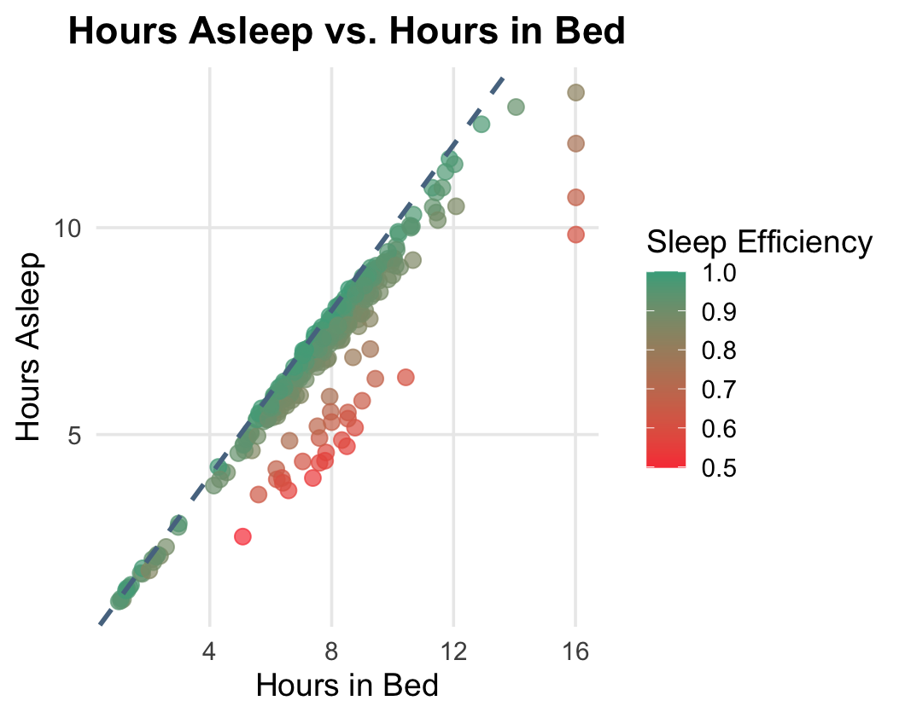

# Bellabeat Fitness Data Analysis
##### How Can a Wellness Technology Company Play It Smart?
##### By: Sandra John
#

## Scenario
Bellabeat is a successful high-tech manufacturer of health-related devices for women. Cofounders Urška Sršen and Sando Mur believe that thorough and detailed analysis of smart device fitness data can help unlock new growth opportunities for the company. 
Bellabeat currently offers five products: 
- Bellabeat app: Tracks health data (ex. sleep, stress, menstrual cycles)
- Leaf: Wellness tracker that can be worn as a bracelet, necklace, or clip
- Time: Wellness watch that connects to the Bellabeat app
- Spring: Water bottle that tracks daily water intake with smart technology
- Bellabeat membership: 24/7 access to personalized guidance on wellness

Although Bellabeat is a small company, it has the potential to become a larger competitor in the fitness device market. As a junior data analyst on the marketing analyst team, I have been tasked with analyzing smart device data to gain insight into how consumers utilize such products. These answers will help guide Bellabeat's marketing strategy and support the development of new products. 

#

## 1. Ask
#### *BUSINESS TASK: Analyze non-Bellabeat smart device data to discover potential growth opportunities and tactical marketing strategies for Bellabeat.* ####

Key Stakeholders:
- Urška Sršen: Cofounder and Chief Creative Officer
- Sando Mur: Cofounder and Mathematician; key member of the executive team
- Bellabeat Marketing Analytics Team

#

## 2. Prepare
Data Source - Fitbit Fitness Tracker Data: https://www.kaggle.com/datasets/arashnic/fitbit

This dataset includes 18 CSV files. Thirty Fitbit users consented to the submission of personal tracker data through a survey from Amazon Mechanical Turk between March 2016 - May 2016. 

This data follows ROCCC:
- Reliability: The data was collected through a reliable source, Amazon Mechanical Turk, who used data from 30 individuals who consented to the utilization of their information.
- Original: This information is from first-party data through data straight from FitBit users
- Comprehensive: All 18 CSV files include information such as minute-level output for physical activity, heart rate, and sleep monitoring
- Current: The data is from 2016, so it is not current and information may be outdated
- Cited: Data is available on Kaggle, with an associated Zenodo DOI

However, there are many limitations to this dataset
- The data is gathered from volunteers, which can create selection bias in the data rather than gathering information from a random sample
- Data may not be the most accurate due to the lack of updates since 2016
- Only 30 user data, according to the central limit theorem a sample size of more than 30 is preferred for accuracy
- Absence of demographics such as gender or age

#

## 3. Process
Transform the data in order to analyze effectively.

After loading packages and adding the CSV files into R, begin the cleaning by fixing the date/time format
```
daily_activity <- daily_activity %>%
+ mutate(ActivityDate = mdy(ActivityDate))
sleep_day <- sleep_day %>%
+ mutate(SleepDay = mdy_hms(SleepDay))
hourly_steps <- hourly_steps %>%
+ mutate(ActivityHour = mdy_hms(ActivityHour))
```

Check for null values
```
sum(is.na(daily_activity))
sum(is.na(sleep_day))
sum(is.na(weight_info))
```
*65 NA were found in weight_info under the Fat column, which is due to manual entry by users. Due to the overwhelming amount of no data, we choose to erase this from any analysis/conclusions*

Check and clean duplicates
```
sum(duplicated(daily_activity))
sum(duplicated(sleep_day))
sum(duplicated(weight_info))
sleep_day <- sleep_day %>% distinct()
```

Looked for validity and ran some code to find that there were 33 user inputs for daily activity, 24 for sleep, and only 8 for weight. 
```
n_distinct(daily_activity$Id) 
n_distinct(sleep_day$Id) 
n_distinct(weight_info$Id)
```
Then, to look further into why this irregularity is occuring, lets look at the manual entries on the weight dataset. Many users submitted their information multiple times which therefore leads to more discrepencies and is a limitation to gaining credible analysis. 
```
weight_info %>%
+     filter(IsManualReport == TRUE) %>%
+     group_by(Id) %>% 
+     summarise("Manual Weight Report"=n()) %>%
+     distinct()
```

#

## 4. Analyze

### Summary
Gather the data and create summary charts to get information such as the min, max, mean, and any outliers. 

```
summary(daily_activity)
summary(sleep_day)
summary(weight_info)
```

### Weight
The mean weight is 158.8 with a BMI of 25.19. For reference, the [National Heart, Blood, and Lung Institute](https://www.nhlbi.nih.gov/health/heart-healthy-living/healthy-weight#:~:text=Language%20switcher&text=A%20healthy%20weight%20for%20adults,more%20information%20about%20these%20topics.&text=Your%20browser%20can't%20play%20this%20video.&text=An%20error%20occurred.,is%20disabled%20in%20your%20browser.) states that healthy BMI range is typically between 18.5 and 24.9.
```
WeightPounds        BMI       
 Min.   :116.0   Min.   :21.45  
 1st Qu.:135.4   1st Qu.:23.96  
 Median :137.8   Median :24.39  
 Mean   :158.8   Mean   :25.19  
 3rd Qu.:187.5   3rd Qu.:25.56  
 Max.   :294.3   Max.   :47.54  
```

### Sleep Efficiency 
Users have an average of 419.2 minutes asleep, which converts to 6.9 hours, and 458.5 minutes in bed, which is 7.6 hours. According to [Harvard Health](https://www.health.harvard.edu/blog/how-much-sleep-do-you-actually-need-202310302986) adults need at least 7 hours of sleep per night, meaning these participants are pretty well rested!
```
TotalMinutesAsleep TotalTimeInBed 
Min.   : 58.0      Min.   : 61.0  
1st Qu.:361.0      1st Qu.:403.8  
Median :432.5      Median :463.0  
Mean   :419.2      Mean   :458.5  
3rd Qu.:490.0      3rd Qu.:526.0  
Max.   :796.0      Max.   :961.0
```

### Activity Minutes
The daily_activity file tells us lots of useful information. For example, we find that the mean number of steps taken in a day is 7406, which is below the recommended 8,000 - 10,000 recommended steps from the [CDC](https://www.cdc.gov/physical-activity-basics/benefits/index.html). When comparing the minutes that users are very active, fairly active, lightly active, or sedentary, we find that the mean for fairly active is the lowest at 13.56 minutes. Another useful piece of information we find is that the average number of calories burned in a day is 2304. Additional information can be found [here](daily_activity_summary.txt).
```
TotalSteps      VeryActiveMinutes FairlyActiveMinutes LightlyActiveMinutes SedentaryMinutes  Calories                                                                     
Min.   :   0    Min.   :  0.00    Min.   :  0.00      Min.   :  0.0        Min.   :   0.0    Min.   :   0                                                                                                          1st Qu.: 729.8  1st Qu.:  0.00    1st Qu.:  0.00      1st Qu.:127.00       1st Qu.: 729.8    1st Qu.:1828
Median : 7406   Median :  4.00    Median :  6.00      Median :199.0        Median :1057.5    Median :2134
Mean   : 7638   Mean   : 21.16    Mean   : 13.56      Mean   :192.8        Mean   : 991.2    Mean   :2304 
3rd Qu.:10727   3rd Qu.: 32.00    3rd Qu.: 19.00      3rd Qu.:264.0        3rd Qu.:1229.5    3rd Qu.:2793
Max.   :36019   Max.   :210.00    Max.   :143.00      Max.   :518.0        Max.   :1440.0    Max.   :4900
```

The CDC also recommends that individuals partake in 30 minutes of moderately active behavior. After running some tests on the results above, we find that the average number of FairlyActiveMinutes + VeryActiveMinutes is 34.7, however, the median is 21 minutes, which causes some discrepancies. Then, looking further we see that the 30 minute goal is only met 42% of the days. This tells us that while some participants may be highly active, others fall short of the guidelines. Bellabeat can profit off of this finding as they should promote getting in 30 minutes of moderate activity each day. 

```
daily_activity %>%
+     mutate(moderate_plus = FairlyActiveMinutes + VeryActiveMinutes) %>%
+     summarise(
+         avg_minutes = mean(moderate_plus, na.rm = TRUE),
+         median_minutes = median(moderate_plus, na.rm = TRUE),
+         pct_goal = mean(moderate_plus >= 30, na.rm = TRUE) * 100
+     )
```

### Steps v Calories

Lets look at the correlation between the number of steps taken v calories burned. By running a correlation test such as: 
```
cor_test <- cor.test(daily_activity$TotalSteps, daily_activity$Calories, method = "pearson")
r_value <- cor_test$estimate
```
We find that the r-value is 0.6, meaning there is a moderate to strong positive correlation between steps and calories. We can deduct from this statistic that the more steps a user takes, the most calories they burn. Bellabeat can use this insight to promote taking more steps a day if an individual is on a weight loss journey and wants to increase the number of calories they burn a day.

#

## 5. Share

Now that the data has been analyzed, we can look at the visual representations to get a better understanding of the insights made. 

### Daily Steps


Most steps taken are in the 3,000 - 9,000 range, and there is a significant decline after the steps hit 10,000, which is represented by the blue dashed line. This shows that most users fall short of the recommended daily steps.

### Hourly Steps


We see that there is an influx of steps from 12-2 and the largest amount of steps taken from 5-7pm. These times correlate with breaks people typically have when working a typical 9-5 job. 12-2pm is the prime time for a lunch break, in which individuals who work at their office might leave to grab food from a nearby restaurant. Additionally, 5-7pm is after work is done and when people might try to workout. These insights can help make meaningful insights into when Bellabeats should notify users to keep moving.

### Steps v Calories


### Sleep Efficiency



The red dots signify users with bad sleep efficiency, meaning the time they spend in bed is a lot higher than hours slept. Users average around 91% sleep efficiency, as we can see through the numerous green dots clustered around the 1:1 line. However, 1 out of 5 nights fall below 90% sleep efficiency, meaning users still need support in gaining restful sleep.

## 6. Act

Using our analysis, we can now making meaningful insights to drive Bellabeat's marketing and product strategies.

- **Encourage more daily activity:** The average user takes around 7,400 steps per day, which falls short of the recommended 8,000-10,000 steps.
     - Action: Bellabeat should introduce step-based challenges and milestone badges to motivate users to take more steps. Additionally, they should include push notifications from 5pm-7pm when people are active and more likely to close their step goals.
- **Promote Physical Activity:** Only around 30% of users meet the CDC's 30 minute guideline when it comes to combined fairly and very active time per day. Additionally, users also spend roughly 16.5 hours per day sedentary, which is around 70% of hours awake during the day.
     - Action: Add guided workouts within the Bellabeat app to give a more accessible option for users to get a quick workout in during the day. Additionally, implement time to move reminders if users have been sedentary for too long at a time, which can also help users who may sit in an office to take brief breaks from sitting.
- **Improve Sleep Quality:** 1 out of 5 nights for users fall below a 90% sleep efficiency, which indicates occasional restlessness.
     - Action: Include mindful or relaxation exercises in the app to help users wind down before bed, specifically automatically lowering screen brightness and breathing techniques. Using the Bellabeat Time, the watch, users can sleep with it on and track their sleeping habits. This can be represented through rings or another visual for them to better understand it.
- **Expand Wellness:** The average BMI is slightly above the healthy range, suggesting promoting wellness trackers and reminders could be beneficial for users.
     - Action: The app can introduce nutrition tracking based on personal activity level which can be found through data on the Bellabeat Leaf. This will ensure that correct information is reported and people are not underfeeding themselves based on outdated statistics or information. Additionally, the Bellabeat Spring can send out reminders during the day if the user is behind on their hydration.
- **Female Representation:** Bellabeat is a high-tech health related company creates for women, by women. While creating the correct products is important, empowering women is one of the most important steps to reach the right audience and make a meaningful impact. Women's health is heavily under studied and by addressing areas such as menstrual health, hormonal changes, and overall well-being, Bellabeat can differentiate itself in the market.
     - Action: Create a menstrual cycle tracking that integrates this data with activity and sleep data to provide insights on how these change during various cycles. The app can also create workout plans based on a womens cycle, such as promoting less intensity excercises during the menstrual phase and higher intensity workouts during the ovulation phase. Additionally, creating educational content and wellness tips on areas such as fertility, menopause, or hormonal balance can help women from all ages. 


 
